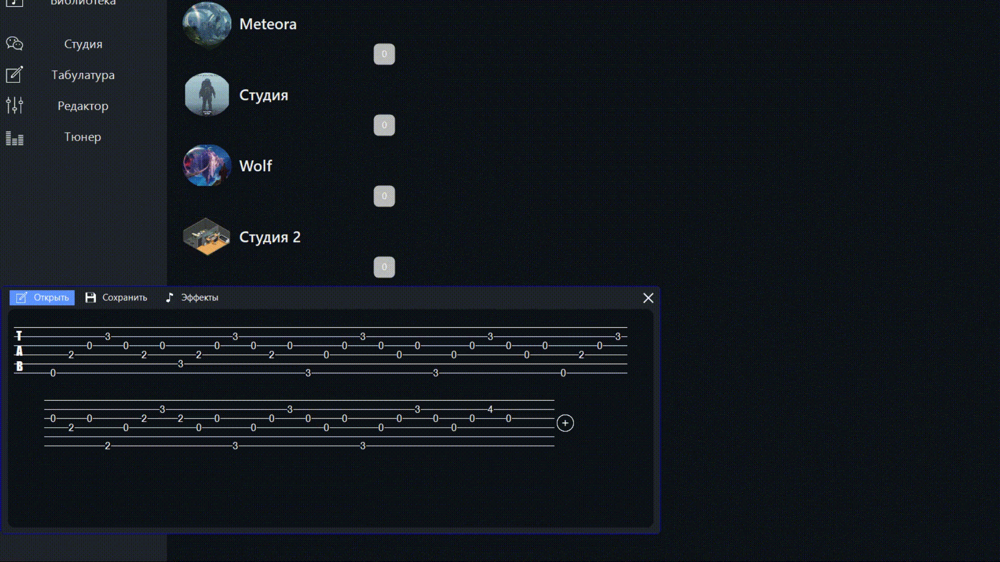
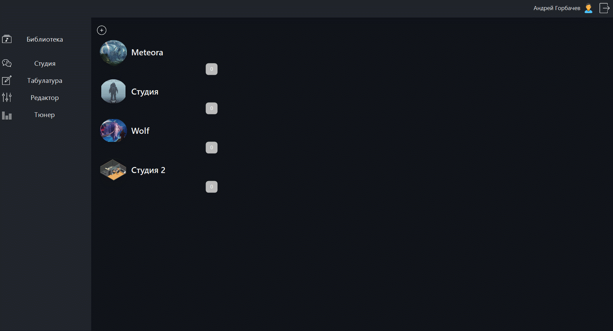

# MusicApp
Модуль настройки музыкального инструмента и редактирования табулатуры для многопользовательского сервиса онлайн записи музыкальных композиций

## Демонстрация работы сервиса

### 1. Настройка музыкального инструмента

  

### 2. Редактирование табулатуры

  

## Стек используемых технологий

- Visual Studio
- C++/CLI
- Naudio
- GunaUI
